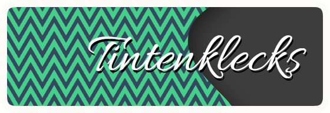

<p align="center">
    
</p>

<h3 align="center">Tintenklecks Gallery</h3>

## Overview

This project is a personal exploration of building desktop UI components with Electron and Vue 3. It started as a way to learn and better understand Electron and Vue 3 in practice, and is built on top of the [electron-vite](https://electron-vite.org/) setup.

The components are designed specifically for desktop applications, following common desktop UI conventions, with naming and behavior informed by [WinUI 3](https://learn.microsoft.com/windows/apps/winui/winui3/), and the set continues to grow over time.

At this stage, the project is not yet a standalone npm component library. Instead, components are developed and iterated within this gallery application, focusing on experimentation and pattern refinement before moving toward a more formal setup.

Visually, the design leans toward a retro, skeuomorphic style, using subtle depth and engraved details to create a classic desktop look and feel.

#### Basic Input

- [TkButton](#tkbutton)
- [TkHyperlinkButton](#tkhyperlinkbutton)
- [TkToggleButton](#tktogglebutton)
- [TkCheckBox](#tkcheckbox)
- [TkRadioButton](#tkradiobutton)
- [TkToggleSwitch](#tktoggleswitch)

#### Dialogs and Popups

- [TkPopup](#tkpopup)

#### Layout

- [TkSeparator](#tkseparator)

#### Status and Info

- [TkToast](#tktoast)

#### Motion

- [TkMarquee](#tkmarquee)

## Components

<a id="tkbutton"></a>
###  TkButton

TkButton is a basic button component for common user actions.

It provides five visual themes: `primary`, `secondary`, `success`, `warning`, and `danger`.
An optional subtle `deboss` effect can be enabled via props, intended to give the content a lightly pressed feel, like text written into paper.

#### Usage

``` html
<TkButton theme="primary" deboss>
  Primary
</TkButton>
```

<a id="tkhyperlinkbutton"></a>
###  TkHyperlinkButton

TkHyperlinkButton is a text-based button component for lightweight, inline user actions.

It provides five visual themes: `primary`, `secondary`, `success`, `warning`, and `danger`.
An optional subtle `emboss` effect can be enabled via props, intended to give the text a slightly raised feel and suggest its clickability. A background color appears on hover to indicate interactivity.

#### Usage

``` html
<TkHyperlinkButton theme="primary" emboss>
  Primary
</TkHyperlinkButton>
```

<a id="tktogglebutton"></a>
###  TkToggleButton

TkToggleButton is a button component that represents a toggleable on/off state.

It shares the same visual themes and optional `deboss` effect as TkButton.

When turned off, the button uses a neutral background regardless of theme.
When turned on, it adopts the selected theme color, with an inner shadow, similar to a physical switch that latches into the on position.

#### Usage

TkToggleButton represents a boolean on/off state and is controlled via `v-model`.

``` html
<TkToggleButton v-model="isOn" theme="primary" deboss>
  Primary
</TkToggleButton>
```
